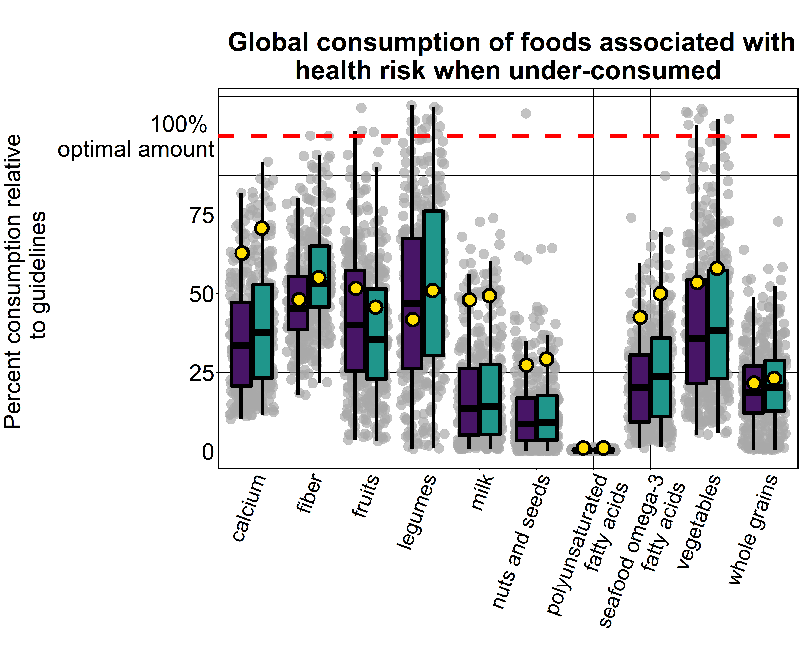
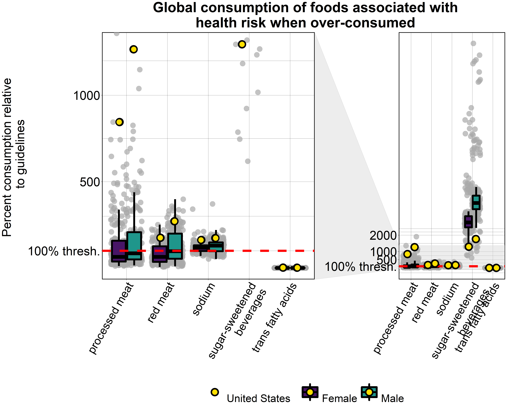
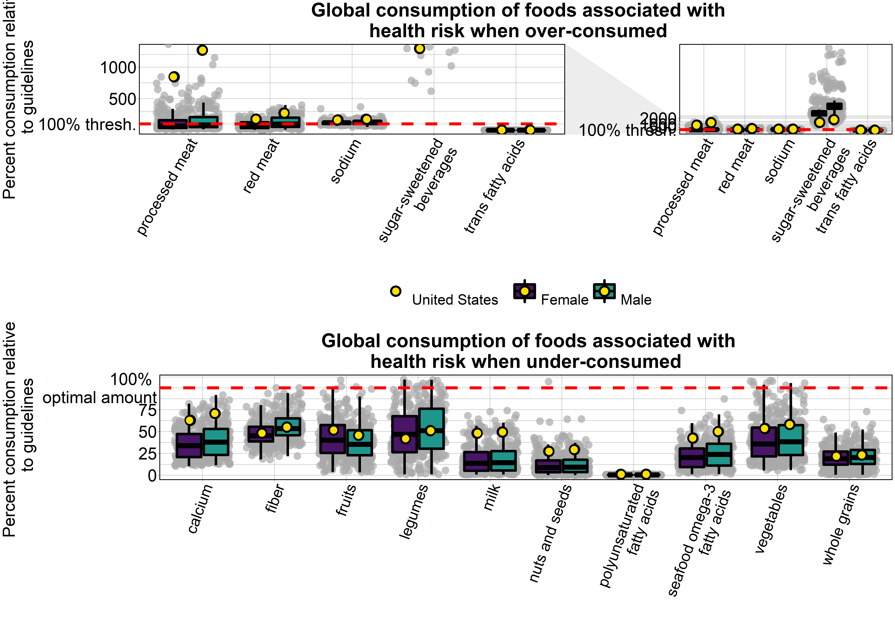
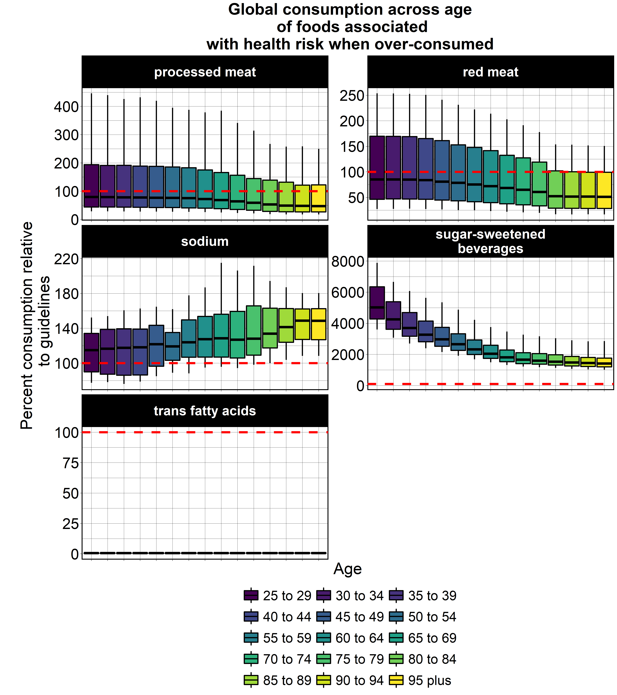
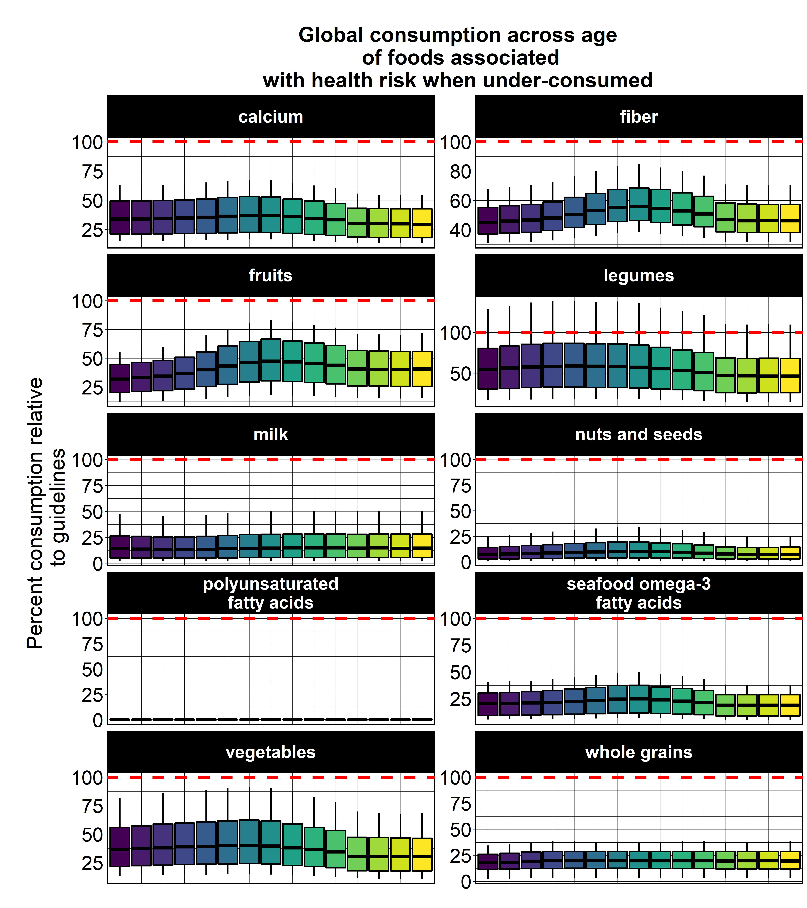

```{r setup, include=FALSE}
knitr::opts_chunk$set(echo = TRUE)
```

# Exercise chunks
## Data Wrangling
* `DW_Code1`
* `DW_Code2`
* `DW_Code3`
* `DW_Code4`
* `DW_Quiz`
* `DW_Exercise`

## Data Visualization
* `DV_Code1`
* `DV_Code2`


# Data Visualization Modifications (to reduce size so that the app can load under 1 minute)

* Run the data visualization part
* Then, save the large gg objects: Under, Over, Over_age, Under_age (code below is not in the index file) [Note: the original code chunks producing these objects were changed to `eval = FALSE`]
```{r, eval=FALSE}
save(Under, Over, Over_age, Under_age, file = "www/data/visualization.rda")
```
* Load this .rda $\rightarrow$ save each plot as png $\rightarrow$ include png (code chunks below are in the index file, control + F)
```{r, eval=FALSE}
load("www/data/visualization.rda")
```

```{r, eval=FALSE}
png("www/img/Under.png", res = 300, width = 17, height = 14, units = "in")
print(Under)
dev.off()


```

```{r, eval=FALSE}
png("www/img/Over.png", res = 300, width = 20, height = 16, units = "in")
print(Over)
dev.off()


```

```{r, eval=FALSE}
png("www/img/Grid1.png", res = 300, width = 26, height = 18, units = "in")
cowplot::plot_grid(Over, Under, ncol = 1)
dev.off()


```

```{r, eval=FALSE}
png("www/img/Over_age.png", res = 300, width = 16, height = 18, units = "in")
print(Over_age)
dev.off()


```

```{r, eval=FALSE}
png("www/img/Under_age.png", res = 300, width = 16, height = 18, units = "in")
print(Under_age)
dev.off()


```

```{r, eval=FALSE}
cowplot::plot_grid(Over,
  Over_age,
  Under,
  Under_age,
  ncol = 2,
  rel_widths = c(2.5, 1)
)

png(
  filename = "www/img/Grid2.png",
  res = 300, width = 34, height = 30, units = "in"
)
cowplot::plot_grid(Over,
  Over_age,
  Under,
  Under_age,
  ncol = 2,
  rel_widths = c(2.5, 1)
)
dev.off()

include_graphics("www/img/Grid2.png")
```
